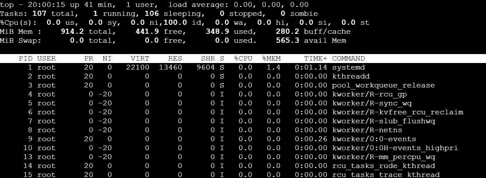

Environment basics

### Kernel and OS Information

`uname -a` --> gives the kernel version

```bash
uname -a
# Output example: Linux hostname 5.10.0-8-generic #1 SMP Debian 5.10.46-5 (2021-09-22) x86_64 GNU/Linux
```

`cat /etc/os-release` --> displays OS release information

```bash
cat /etc/os-release

# Output example:
# PRETTY_NAME="Debian GNU/Linux 11 (bullseye)"
# NAME="Debian GNU/Linux"
# VERSION_ID="11"
# VERSION="11 (bullseye)"
# VERSION_CODENAME=bullseye
# ID=debian
# HOME_URL="https://www.debian.org/"
# SUPPORT_URL="https://www.debian.org/support"
# BUG_REPORT_URL="https://bugs.debian.org/"
```

### File System Sanity

- `mkdir /tmp/runbook-demo` - creates a directory named runbook-demo
- `cp /etc/hosts /tmp/runbook-demo/hosts` - copies hosts file successfully
- `ls -l /tmp/runbook-demo` - lists all files with permissions

Note: `la -l` is an alias for `ls -al`, commonly observed in shell configurations.

### CPU/Memory

`top` - displays processes ranked by CPU and memory consumption



`htop` - horizontal and vertical interaction mode


`free -h` - displays memory usage in human-readable format

```bash
free -h

# Output example:
#                total        used        free      shared  buff/cache   available
# Mem:           15Gi       8.2Gi       2.1Gi       256Mi       4.7Gi       6.2Gi
# Swap:          2.0Gi          0B       2.0Gi
```

`df -h` - shows disk space usage for all mounted filesystems

```bash
df -h -> looks normal the consumed space on root

free -h

# Output example:
#                total        used        free      shared  buff/cache   available
# Mem:           15Gi       8.2Gi       2.1Gi       256Mi       4.7Gi       6.2Gi
# Swap:          2.0Gi          0B       2.0Gi
```

iostat ---> provides CPU and memory utilization report

vmstat --> provides realtime reports on processes I/0,memory,paging,disk and CPU usage

### Network

`ss -tulpn | grep ssh` - checks if the SSH service is listening on network ports

`curl -i https://trainwithshubham.com` - retrieves webpage contents with HTTP headers

### Logs

`journalctl -u ssh -n 50` - retrieves the first 50 logs from the SSH service

```bash
journalctl -u ssh -n 50
```

`tail -n 50 /var/log/auth.log` - retrieves the last 50 logs from authentication log file

```bash
tail -n 50 /var/log/auth.log
```


