### Task 1: Explore Default Namespaces

Explore built-in namespaces with below command

kubectl get namespaces

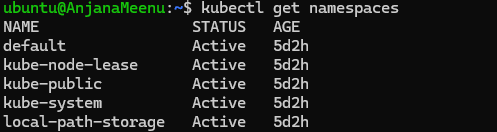

I get to see the above pods running in the default namespace 
 -control plane
 -ApiServer
 -Scheduler and
 -Proxy

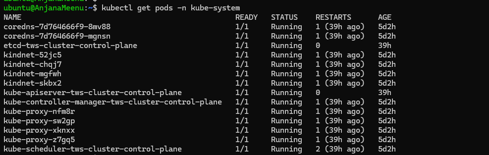

I get to see a count of 14 pods in kube-system

### Task 2: Create and Use Custom Namespaces

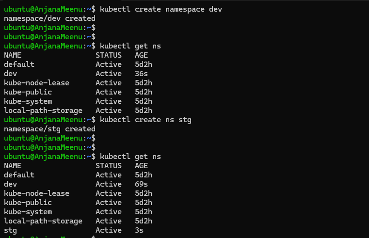

create a namespace using yaml

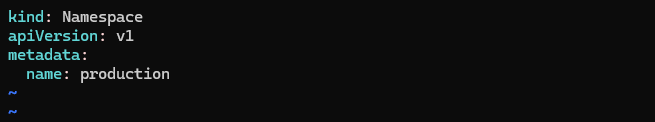

once created use the following command
kubectl apply -f namespace.yaml

created namespace using yaml

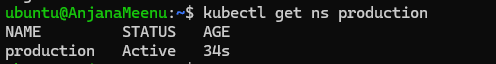

run an nginx pod in dev

kubectl run nginx-dev --image=nginx:latest -n dev

kubectl run nginx-prod --image=nginx:latest -n prod

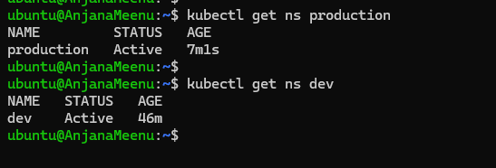

kubetctl get pods -A

commands to get pods present across all the namespaces

kubectl get pods -A

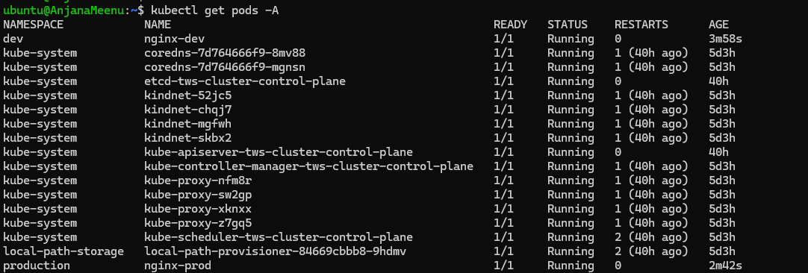

### Task 3: Create Your First Deployment

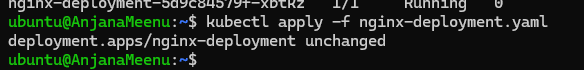

### Task 4: Self-Healing — Delete a Pod and Watch It Come Back
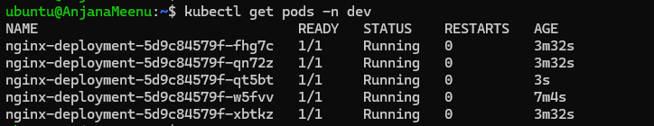

### Task 5: Scale the Deployment
Scale up/down the deployment

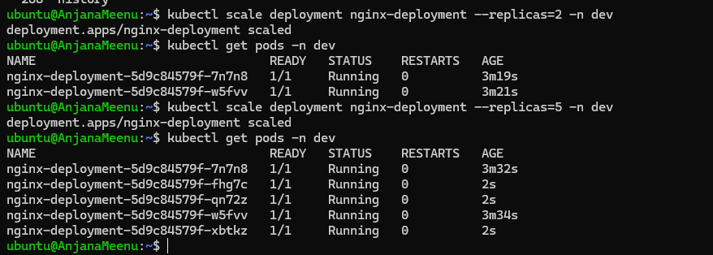

### Task 6: Rolling Update

kubectl set image deployment/nginx-deployment nginx=nginx:1.25 -n dev

kubectl rollout status deployment/nginx-deployment -n dev 

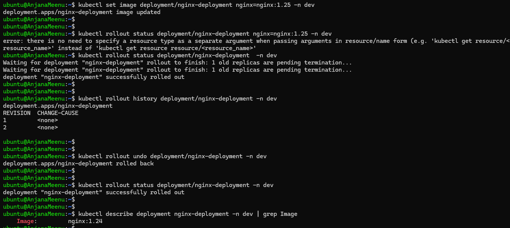

### Task 7: Clean Up

kubectl delete deployment nginx-deployment -n dev
kubectl delete pod nginx-dev -n dev

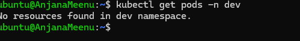