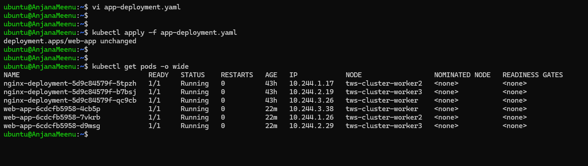
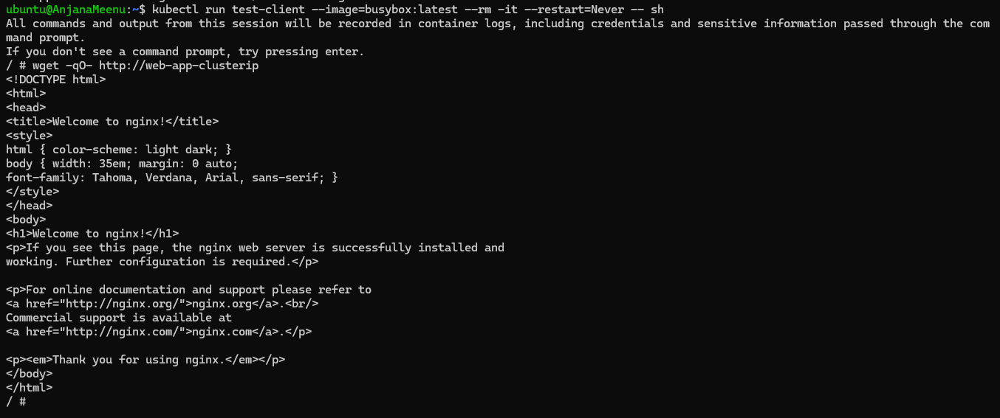
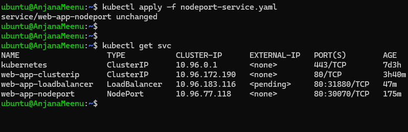
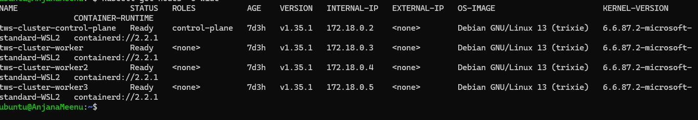
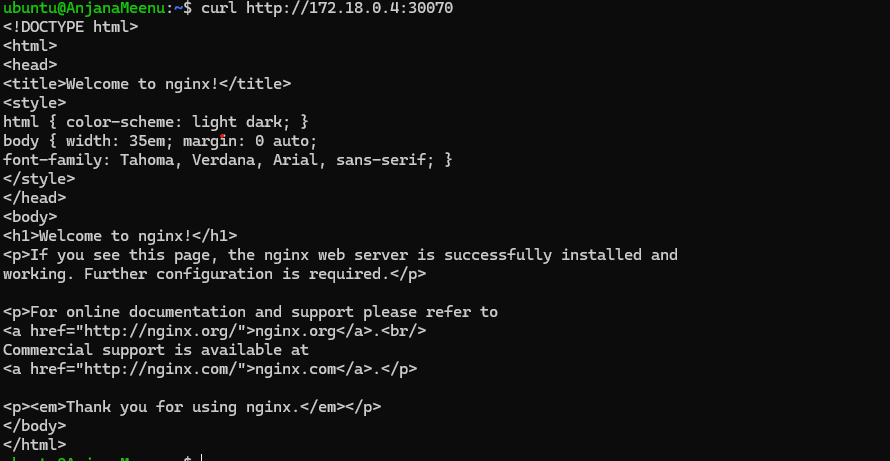
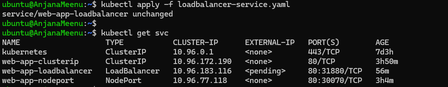
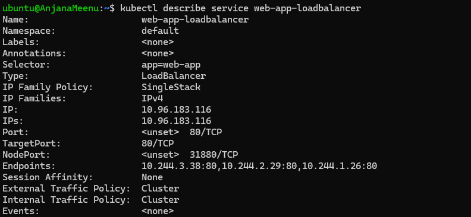
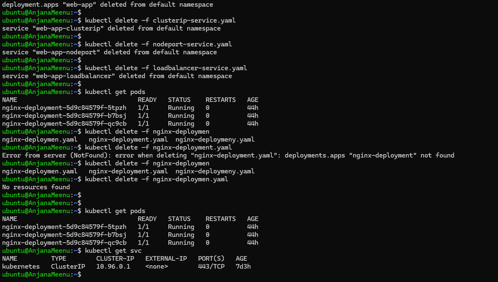

Service in kubernetes provides an abstraction that defines the logical set of pods and how to access them 

Service provides a stable Ip address and DNS name that acts as a front-door for your application 

Service makes use of labels and selectors to identify/select which pod to be used based on the label defined

Ports:
port: the port where the service itslef reachable on

targetport: the port the container inside the pod listening on

nodeport: the port exposed on all cluster nodes

Service types:
Cluster Ip: for internal 
NodePort: for external
LoadBalancer: External
ExternalName: External Mapping

### Task 1: Deploy the Application

create a deployment file app-deployment.yaml as below

```yaml
apiVersion: apps/v1
kind: Deployment
metadata:
  name: web-app
  labels:
    app: web-app
spec:
  replicas: 3
  selector:
    matchLabels:
      app: web-app
  template:
    metadata:
      labels:
        app: web-app
    spec:
      containers:
       - name: nginx
         image: nginx:1.25
         ports:
           - containerPort: 80
```

kubectl apply -f app-deployment.yaml 

kubectl get pods -o wide



After a rolling restart the NodIp/PodIp changes which can be seen below


### Task 2: ClusterIP Service (Internal Access)

create clusteIp such that even after restart the ip doesn't change

created `clusterip-service.yaml`:

```yaml
apiVersion: v1
kind: Service
metadata:
  name: web-app-clusterip
spec:
  type: ClusterIP
  selector:
    app: web-app
  ports:
  - port: 80
    targetPort: 80
```

```bash
kubectl apply -f clusterip-service.yaml
kubectl get services
```

Output after executing the above commands


```bash
# Run a temporary pod to test connectivity
kubectl run test-client --image=busybox:latest --rm -it --restart=Never -- sh
exit
```


### Task 3: Discover Services with DNS

```bash
kubectl run dns-test --image=busybox:latest --rm -it --restart=Never -- sh

# Inside the pod:
# Short name (works within the same namespace)
wget -qO- http://web-app-clusterip

# Full DNS name
wget -qO- http://web-app-clusterip.default.svc.cluster.local

# Look up the DNS entry
nslookup web-app-clusterip
exit
```


### Task 4: NodePort Service (External Access via Node)

```bash
apiVersion: v1
kind: Service
metadata:
  name: web-app-nodeport
spec:
  type: NodePort
  selector:
    app: web-app
  ports:
  - port: 80
    targetPort: 80
    nodePort: 30070
```


```bash
kubectl apply -f nodeport-service.yaml
kubectl get services
```

```bash
kubectl get nodes -o wide #to get nodeIps
```


```bash
curl http://localhost:30080
```


### Task 5: LoadBalancer Service (Cloud External Access)

Create `loadbalancer-service.yaml`:

```yaml
apiVersion: v1
kind: Service
metadata:
  name: web-app-loadbalancer
spec:
  type: LoadBalancer
  selector:
    app: web-app
  ports:
  - port: 80
    targetPort: 80
```

```bash
kubectl apply -f loadbalancer-service.yaml
kubectl get services
```


It shos the status as pending as there is no external facing Ip configured on the local cluster

### Task 6: Understand the Service Types Side by Side

Check all 3 services using 

```bash
kubectl get services -o wide
```
this gives the cluster-ip used for internal communication b/w pods
node-port for dev/testing/direct node access and load balancer to handle production traffic external communication

**Verify:** Does the LoadBalancer service also have a ClusterIP and NodePort assigned?

yes a loadbalancer service also has ClusterIP and NodePort assigned

```bash
kubectl describe service web-app-loadbalancer
```


### Task 7: Clean Up

```bash
kubectl delete -f app-deployment.yaml
kubectl delete -f clusterip-service.yaml
kubectl delete -f nodeport-service.yaml
kubectl delete -f loadbalancer-service.yaml

kubectl get pods
kubectl get services
```

