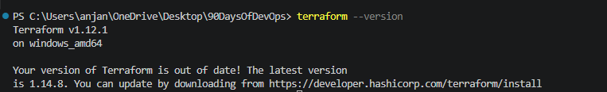
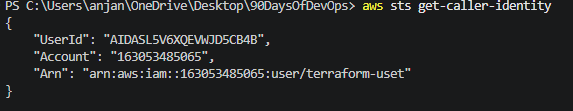
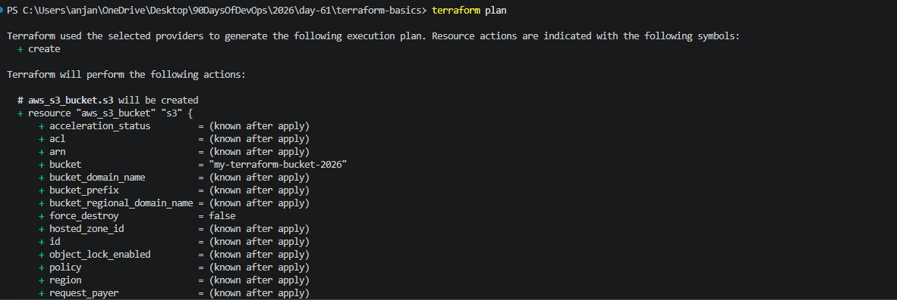
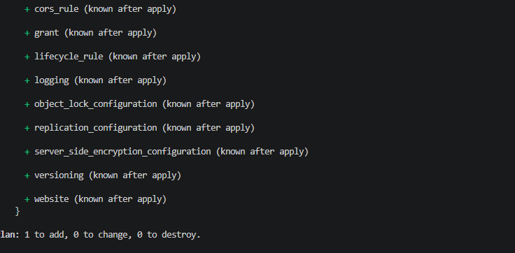
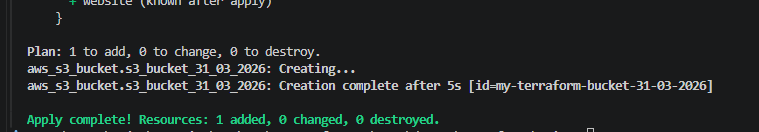
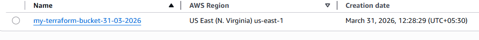
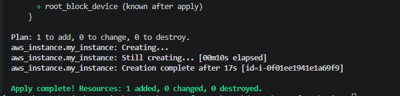
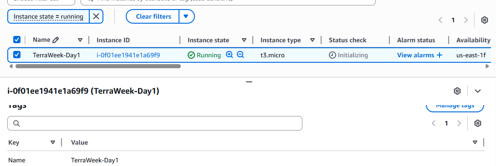

### Task 1: Understand Infrastructure as Code

 What is Infrastructure as Code (IaC)? Why does it matter in DevOps?

 - IAC helps to provision infrastructure through machine readable definition    files  rather than physical hardware and configuration tools

 - IAC matters a lot in Devops where infrastructure can be provisioned automated and scaled within minutes instead of clicking buttons

 - Speed and Efficiency
 - Consistency reducing manual errors
 - Version Control
 -  Scalalbility and Improved Collaboration 
 -  IAC is declarative and cloud-agnostic

What problems does IaC solve compared to manually creating resources in the AWS console?

IAC helps helps automating and provisioning the Infrastructure without manual intervention

Changes made can be tracked and issues can be easily identified and fixed

Reducing manual errors, speed and efficiency can be improved

How is Terraform different from AWS CloudFormation, Ansible, and Pulumi?

Terraform Vs AWS Cloud Formation:

Scope: AWS Cloud Formation is native to AWS and cannot be integrated with other cloud providers.

Flexibility: Terraform uses Providers to talk to almost any API 

Terraform Vs Ansible:

Scope: Terraform is for infrastrucutre provisioning where as Ansible is used for configuration management

In Terraform you build the infrastrucuture like Servers,Network and Storage where as Ansible is used for furnishing like installing/updating packages etc

Terraform is a declarative it is based on the contents present in the state file where as Ansible is procedural which involved sequential task execution

Terraform Vs Pulumi:

Terraform uses HCL a domain specific language which is easy to read 

Pulumi allows you to use standard programming languages like Typescript or Python

What does it mean that Terraform is "declarative" and "cloud-agnostic"?

Terraform is declarative because you describe the end state what should be and what's gonna happen and cloud-agnostic meaning it is suitable for all the cloud providers 

### Task 2: Install Terraform and Configure AWS

1. choco install terraform

2. verfy version

3. Install and configure the AWS CLI:

aws --configure 
# Enter your Access Key ID, Secret Access Key, default region

4. Verify AWS access:

# verify using aws sts get-caller-identity

### Task 3: Your First Terraform Config -- Create an S3 Bucket

resource S3 bucket "aws_s3_bucket.s3_bucket_31_03_2026" created

S3 bucket created in AWS

### Task 4: Add an EC2 Instance

Ec2 instance created in AWS with tage "TerraWeek-Day1"
