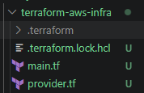

### Task 1: Explore the AWS Provider

provider.tf

terraform {
  required_providers {
    aws = {
        source  = "hashicorp/aws"
        version = "~> 5.0"
    }
  }
}
 provider "aws" {
 region = "us-east-1"

}

`~> 5.0` Allows 5.0.1,5.0.2...5.99 but not 6.xxx (stay within version 5)
`>= 5.0` Allows anything from 5.0 and above
`=5.0.0` Allows only 5.0.0 and not others

### Task 2: Build a VPC from Scratch

create VPC,Subnet,Rooutetable and InternetGateway

   