### Task 1: Extract Variables

created infrasturcutre components
   - `region` (string, default: your preferred region)
   - `vpc_cidr` (string, default: `"10.0.0.0/16"`)
   - `subnet_cidr` (string, default: `"10.0.1.0/24"`)
   - `instance_type` (string, default: `"t2.micro"`)
   - `project_name` (string, no default -- force the user to provide it)
   - `environment` (string, default: `"dev"`)
   - `allowed_ports` (list of numbers, default: `[22, 80, 443]`)
   - `extra_tags` (map of strings, default: `{}`)

### Task 2: Variable Files and Precedence
terraftom.tfvars over rides dault variables.tf
where as if variable is given during plan/apply in CLI it over rides everything and has the highest precedence over everyone

if an env variable is created and given in an CLI it will over ride default but not tfvars

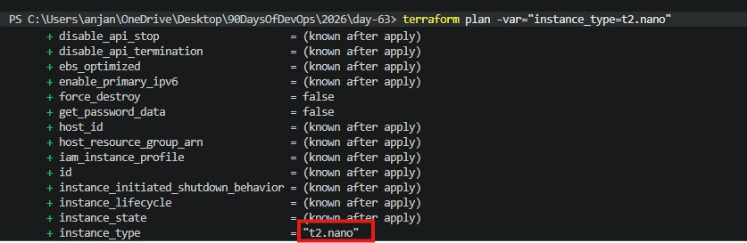

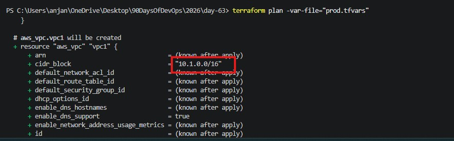

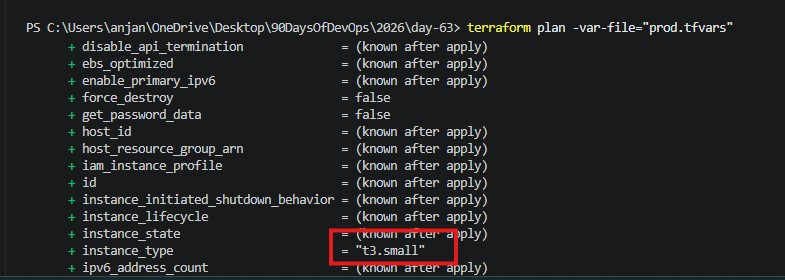
### Task 3: Add Outputs

created an outputs.tf file as below

1. `vpc_id` -- the VPC ID
2. `subnet_id` -- the public subnet ID
3. `instance_id` -- the EC2 instance ID
4. `instance_public_ip` -- the public IP of the EC2 instance
5. `instance_public_dns` -- the public DNS name
6. `security_group_id` -- the security group ID

use terrafrom output followed by output <resource-name> to output the value

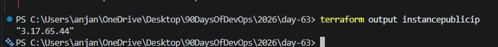

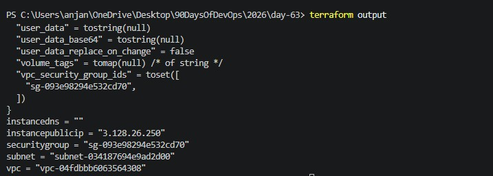

### Task 4: Use Data Sources
Instead of hardcoding use data to fetch it dynamically

the config works in any region without changing the AMI-Id

outputs for each in different regions

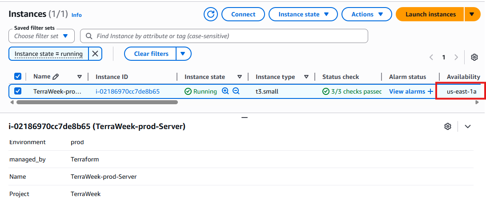

### Task 5: Use Locals for Dynamic Values

1. Created local block to dynamically change values

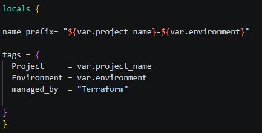

2. Replace all Name tags with `local.name_prefix`:

tags for VPC

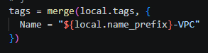

tags for Subnet

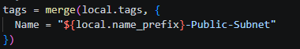

tags for instance

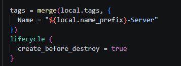

tags created on AWS for instance,VPC and Subnet

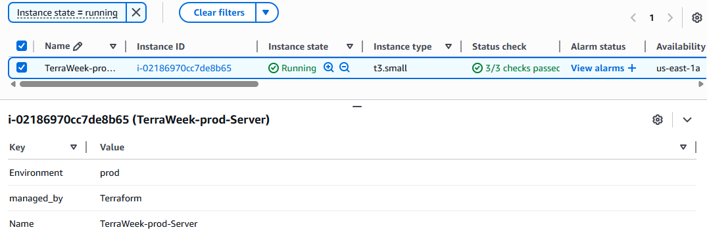  tags for instance

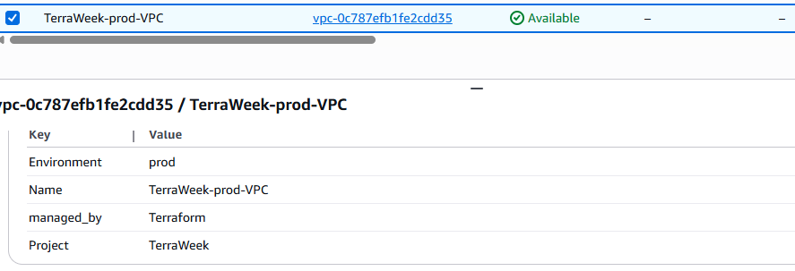 tags for VPC

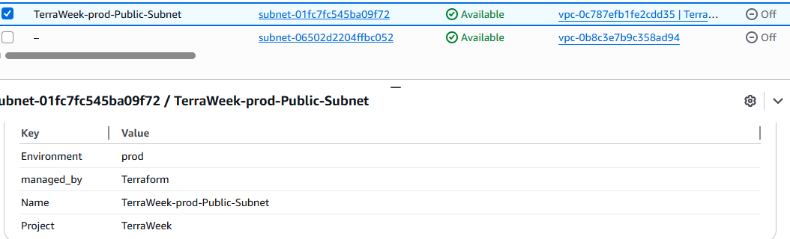 tags for subnet

3. Merge common tags with resource-specific tags:

merged tags with resource specific as resources are created in Prod every resource has a tag specific like Prod

### Task 6: Built-in Functions and Conditional Expressions

1. **String functions:**
   - `upper("terraweek")` -> `"TERRAWEEK"`
   - `join("-", ["terra", "week", "2026"])` -> `"terra-week-2026"`
   - `format("arn:aws:s3:::%s", "my-bucket")` -> "arn:aws:s3:::my-bucket"

2. **Collection functions:**
   - `length(["a", "b", "c"])` -> `3`
   - `lookup({dev = "t2.micro", prod = "t3.small"}, "dev")` -> `"t2.micro"`
   - `toset(["a", "b", "a"])` -> removes duplicates

3. **Networking function:**
   - `cidrsubnet("10.0.0.0/16", 8, 1)` -> `"10.0.1.0/24"`

4. **Adding a conditional expression to config file:**
   instance_type = var.environment == "prod" ? "t3.small" : "t2.micro"

   when the var.environment is changed to "prod" it will spin upa t3.small instance

5 functions that I would choose to pick are

lookup,join,length,cidrsubnet and toset
