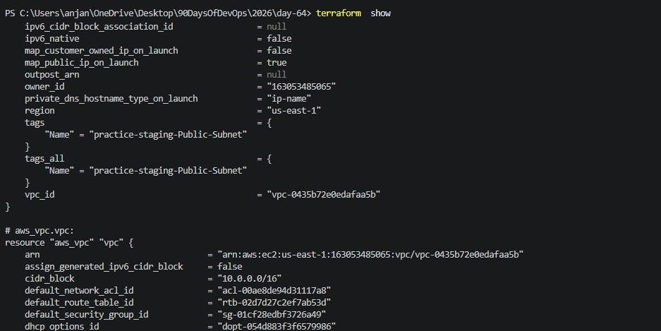
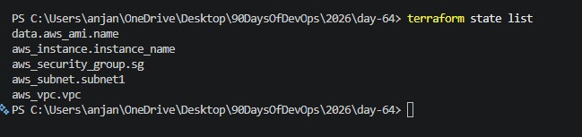
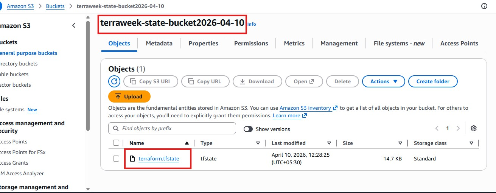
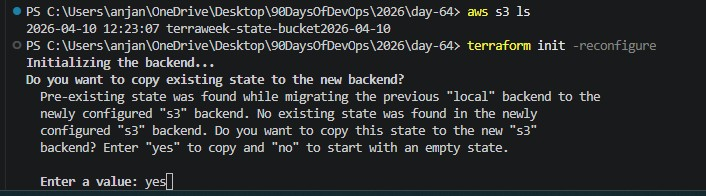
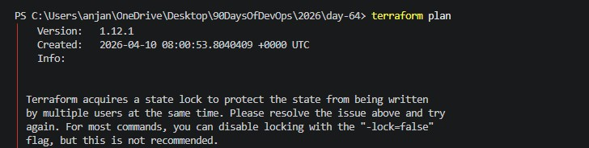
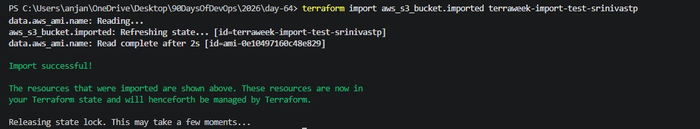
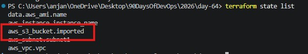

 Day 64 -- Terraform State Management and Remote Backends

### Task 1: Inspect Your Current State

1. How many resources does Terraform track?

Terraform keeps track of all the resources in the state file

2. What attributes does the state store for an EC2 instance?

Terraform stores more info than specified for an Ec2 instance

3. Open `terraform.tfstate` in an editor -- find the `serial` number. What does it represent?

Serial number in tf.state file represents the no. of  times the state file has been updated or version number

### Task 2: Set Up S3 Remote Backend

Setting up a remote backend for state locking and versioning

 

### Task 3: Test State Locking

state locvk acquired when trying to run terraform plan at a time from two terminals

### Task 4: Import an Existing Resource

importing an existing S3 bucket 

### Task 5: State Surgery -- mv and rm

1. **Rename a resource in state:**

2. **Remove a resource from state (without destroying it):**

3. **Re-import it** to bring it back:

### Task 6: Simulate and Fix State Drift

After making changes to Ec2 tags as "manually created" and running terraform plan again it will drifts back to the tags that has been given in the config file and running terraform plan again would detect no changes from in the desired state from the current state

