# Day 65 -- Terraform Modules: Build Reusable Infrastructure

### Task 1: Understand Module Structure

module structure

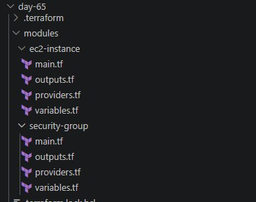

### Task 2: Build a Custom EC2 Module

created a custom ec2 module `modules/ec2-instance/`

1. `variables.tf`

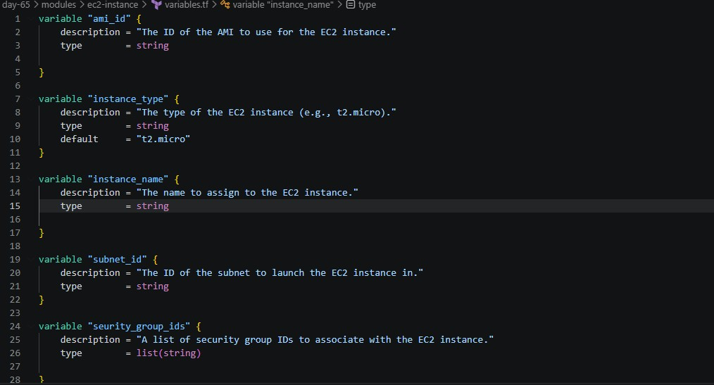

2. `main.tf`

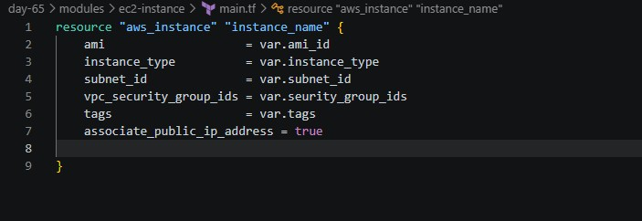alt text


3. `provider.tf`

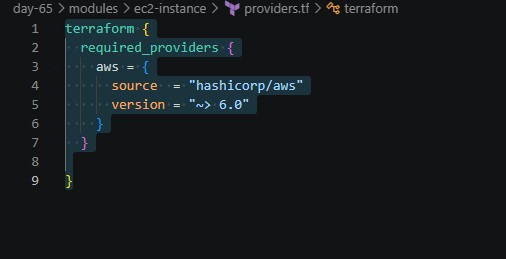

4. `output.tf`

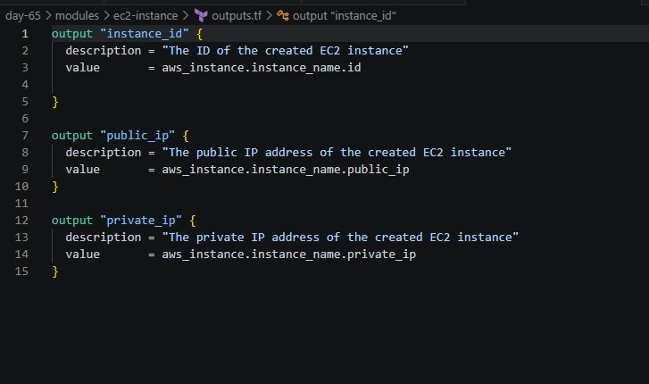


### Task 3: Build a Custom Security Group Module

1. `variables.tf`

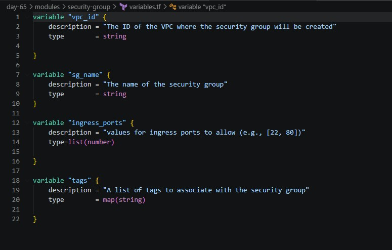

2. `main.tf`

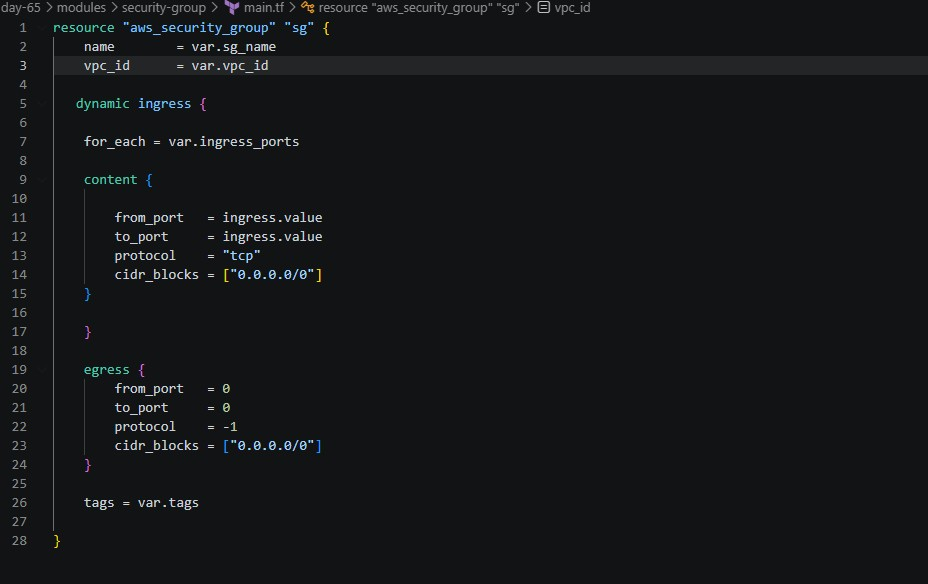

3. `output.tf`

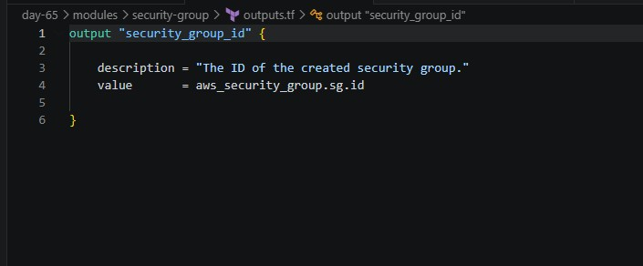

4. `provider.tf`

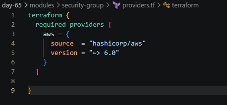


### Task 4: Call Your Modules from Root

1. Create a VPC and subnet directly

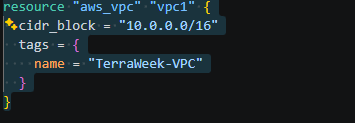

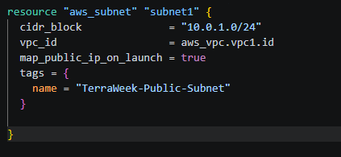

2. Call the security group module:

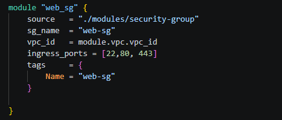

3. Call the EC2 module -- deploy **two instances** with different names using the same module:

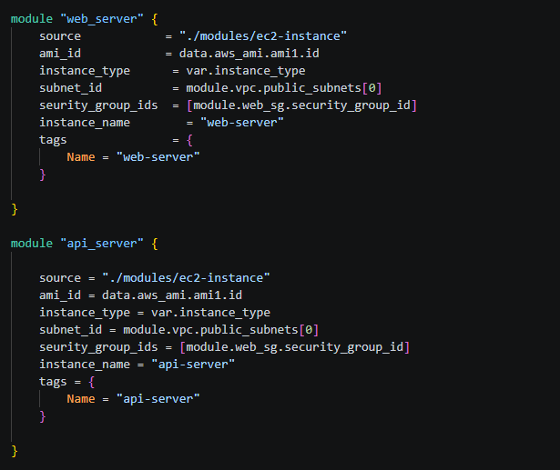

4. Add root outputs that reference module outputs:

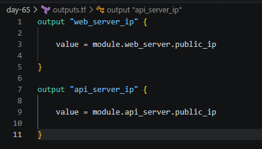

5. Apply:
```bash
terraform init    # Downloads/links the local modules
terraform plan    # Should show all resources from both module calls
terraform apply
```

this will create two instances with different names using the same module and outputs their public ip address

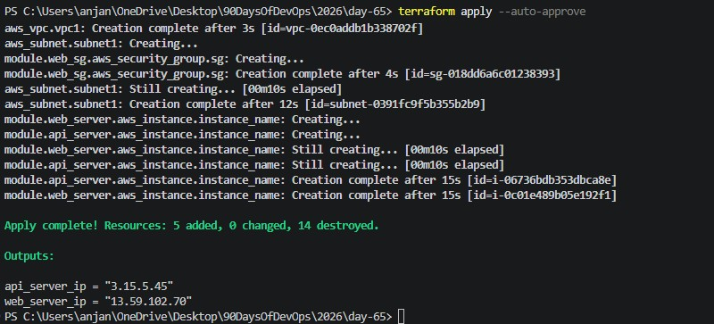

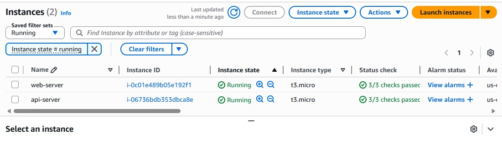 `2 instances same SG different names`

### Task 5: Use a Public Registry Module

1. Replace your hand-written VPC resources with:

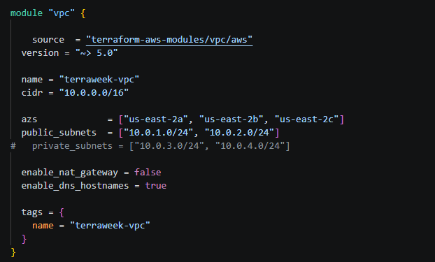

2. Update your EC2 and SG module calls to reference `module.vpc.vpc_id` and `module.vpc.public_subnets[0]`

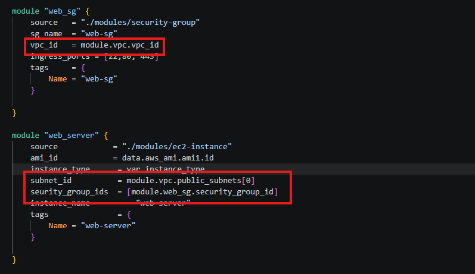

3. Run:
```bash
terraform init     # Downloads the registry module
terraform plan
terraform apply
```

4. Compare: how many resources did the VPC module create vs your hand-written VPC from Day 62?

the VPC module created 14 resources when compared to the hand-written VPC which is 5


### Task 6: Module Versioning and Best Practices

### Task 6: Module Versioning and Best Practices
1. Pin your registry module version explicitly:
   - `version = "5.1.0"` -- exact version
   - `version = "~> 5.0"` -- any 5.x version
   - `version = ">= 5.0, < 6.0"` -- range

2. Run `terraform init -upgrade` to check for newer versions

3. Check the state to see how modules appear:
```bash
terraform state list
```

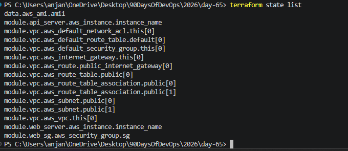 `shows how the modules appear`

```bash
terraform destroy 

```
destroy all the resources created
