# Day 66 -- Provision an EKS Cluster with Terraform Modules

### Task 1: Project Setup

`provders.tf`

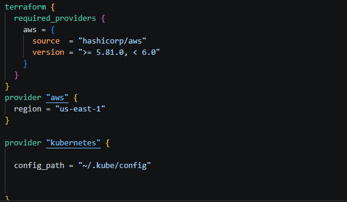

`vpc.tf`

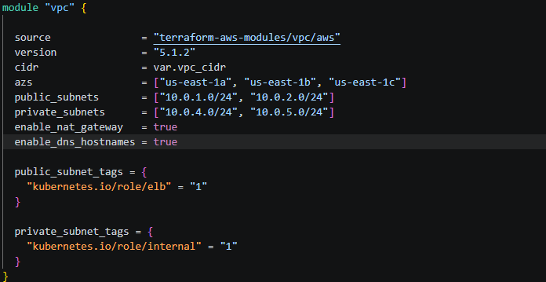

`variables.tf`
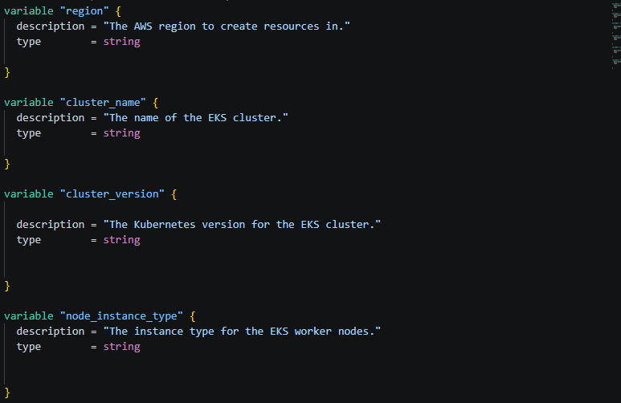

### Task 2: Create the VPC with Registry Module

`vpc.tf` created making use of terraform module


terraform apply 
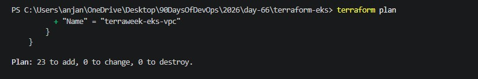

Why does EKS need both public and private subnets? What do the subnet tags do?

it does require both public and private subnets for EKS for internal and external communication

Internet → ALB (Public Subnet) → Pods (Private Subnet)
Pods → NAT Gateway → Internet

### Task 3: Create the EKS Cluster with Registry Module

`eks.tf` created usig terraform module

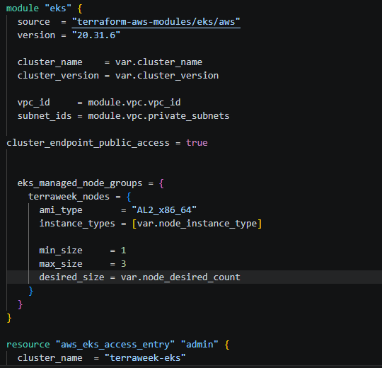

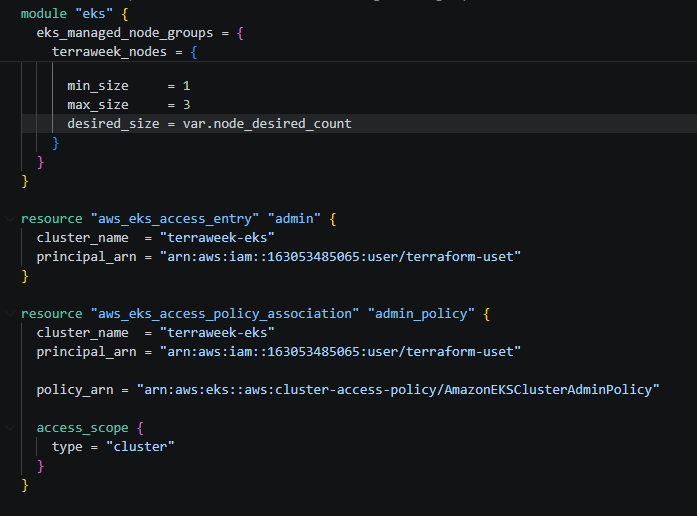

### Task 4: Apply and Connect kubectl

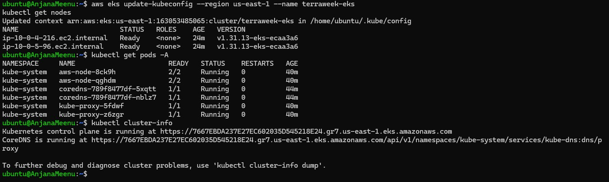

4. Verify:


### Task 5: Deploy a Workload on the Cluster

1. Create a file `k8s/nginx-deployment.yaml`:
```yaml
apiVersion: apps/v1
kind: Deployment
metadata:
  name: nginx-terraweek
  labels:
    app: nginx
spec:
  replicas: 3
  selector:
    matchLabels:
      app: nginx
  template:
    metadata:
      labels:
        app: nginx
    spec:
      containers:
      - name: nginx
        image: nginx:latest
        ports:
        - containerPort: 80
---
apiVersion: v1
kind: Service
metadata:
  name: nginx-service
spec:
  type: LoadBalancer
  selector:
    app: nginx
  ports:
  - port: 80
    targetPort: 80
```

2. Apply:
```bash
kubectl apply -f k8s/nginx-deployment.yaml
```
3. Wait for the LoadBalancer to get an external IP:
```bash
kubectl get svc nginx-service -w

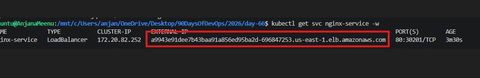

4. Access the Nginx page via the LoadBalancer URL

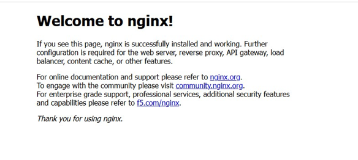

5. Verify the full picture:
```bash
kubectl get nodes
kubectl get deployments
kubectl get pods
kubectl get svc
```
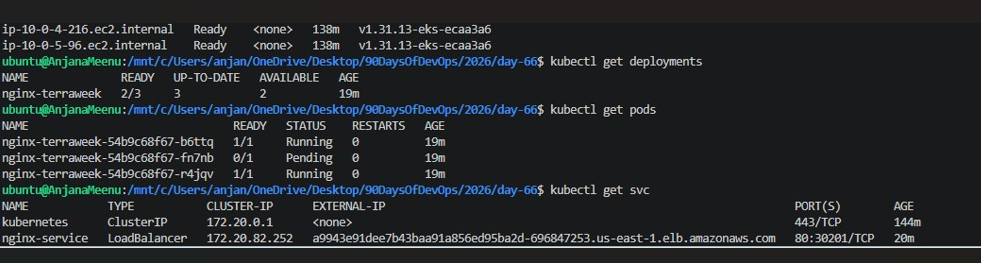

nginx page loaded using external LB

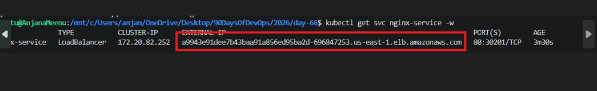

### Task 6: Destroy Everything

1. First, remove the Kubernetes resources (so the AWS LoadBalancer gets deleted):
```bash
kubectl delete -f k8s/nginx-deployment.yaml
```

2. Wait for the LoadBalancer to be fully removed (check EC2 > Load Balancers in AWS console)

3. Destroy all Terraform resources:
```bash
terraform destroy
```
This will take 10-15 minutes.

4. Verify in the AWS console:
   - EKS clusters: empty
   - EC2 instances: no node group instances
   - VPC: the terraweek VPC should be gone
   - NAT Gateways: deleted
   - Elastic IPs: released

