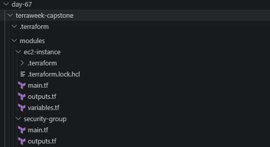
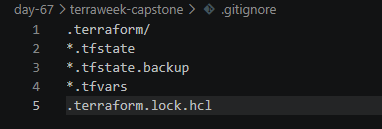

# Day 67 -- TerraWeek Capstone: Multi-Environment Infrastructure with Workspaces and Modules


### Task 1: Learn Terraform Workspaces

Terraform workspaces helps to maintain multiple distinct state files using the same IAC configuration, it is used primarily for creating multiple environments like Dev,Stage and Prod without duplicating the code.

It is like different rooms in the same house where the configuration remains the same, each workspace has it's own independant state file 

### Task 2: Set Up the Project Structure

Project structure



`.gitignore`



git ignore file can be coinded as a safety measure that we can incorporate such that sensitive files aren't pushed to the repo which is accessible by everyone and also any files that wouldn't want to be tracked

### Task 3: Build the Custom Modules

**Module 1: `modules/vpc/`**

`main.tf`

```bash
resource "aws_vpc" "vpc" {
  cidr_block = var.cidr

  tags = merge(
    var.tags,
    {
      Name = "${var.project_name}-vpc"
    }
  )
}

resource "aws_subnet" "public" {
  vpc_id     = aws_vpc.vpc.id
  cidr_block = var.public_subnet_cidr

  map_public_ip_on_launch = true

  tags = merge(
    var.tags,
    {
      Name = "${var.project_name}-public-subnet"
    }
  )
}

resource "aws_internet_gateway" "igw" {
  vpc_id = aws_vpc.vpc.id

  tags = merge(
    var.tags,
    {
      Name        = "${var.project_name}-igw"
      Environment = var.environment
      Project     = var.project_name
    }
  )
}

resource "aws_route_table" "public" {
  vpc_id = aws_vpc.vpc.id

  tags = merge(
    var.tags,
    {
      Name        = "${var.project_name}-rt"
      Environment = var.environment
      Project     = var.project_name
    }
  )
}

resource "aws_route" "default" {
  route_table_id         = aws_route_table.public.id
  destination_cidr_block = "0.0.0.0/0"
  gateway_id             = aws_internet_gateway.igw.id
}

resource "aws_route_table_association" "public" {
  subnet_id      = aws_subnet.public.id
  route_table_id = aws_route_table.public.id
}

```

`variables.tf`

```bash

variable "ami_id" {}
variable "instance_type" {}
variable "subnet_id" {}
variable "security_group_ids" {
  type = list(string)
}
variable "environment" {}
variable "project_name" {}
variable "tags" {
  type = map(string)
}

```
`outputs.tf`

```bash

output "vpc_id" {
  value = aws_vpc.vpc.id
}

output "subnet_id" {
  value = aws_subnet.public.id
}

```

**Module 2: `modules/security-group/`**

`main.tf`
```bash
resource "aws_security_group" "security_group" {
  name   = "${var.project_name}-sg"
  vpc_id = var.vpc_id

  dynamic "ingress" {
    for_each = var.ingress_ports
    content {
      from_port   = ingress.value
      to_port     = ingress.value
      protocol    = "tcp"
      cidr_blocks = ["0.0.0.0/0"]
    }
  }

  egress {
    from_port   = 0
    to_port     = 0
    protocol    = "-1"
    cidr_blocks = ["0.0.0.0/0"]
  }

  tags = merge(
    var.tags,
    {
      Name = "${var.project_name}-sg"
    }
  )
}
```

`variables.tf`

```bash
variable "vpc_id" {}
variable "ingress_ports" {
  type = list(number)
}
variable "environment" {}
variable "project_name" {}
variable "tags" {
  type = map(string)
}
```

`outputs.tf`

```bash
output "sg_id" {
  value = aws_security_group.security_group.id
}
```

**Module 3: `modules/ec2-instance/`**

`main.tf`

```bash
resource "aws_instance" "ec2_instance" {
  ami                    = var.ami_id
  instance_type          = var.instance_type
  subnet_id              = var.subnet_id
  vpc_security_group_ids = var.security_group_ids

  tags = merge(
    var.tags,
    {
      Name = "${var.project_name}-ec2"
    }
  )
}
```

`variables.tf`

```bash
variable "cidr" {}
variable "public_subnet_cidr" {}
variable "environment" {}
variable "project_name" {}
variable "tags" {
    type = map(string)
  
}
```

`outputs.tf`

```bash
output "instance_id" {
  value = aws_instance.ec2_instance.id
}

output "public_ip" {
  value = aws_instance.ec2_instance.public_ip
}
```
