### Task 1: Understand Ansible

1.  What is configuration management?
    Configuration management ensures consistency,improves stability and performance,Sclalbility,Accelerate Development,Disaster Recovery and Auditing

2.  How is Ansible different from Chef, Puppet, and Salt?
    Ansible has agentless architecture and its simplicity using human readable YAML configuration.Puppet and Chef are traditionally agent based and require programming knowledge.

3.  What does "agentless" mean? How does Ansible connect to managed nodes?
    Agentless mean it doesn't reaquired any specialized software agents, or daemons to be installed,it relies on exisitng protocols like SSH for Linux and WINRM for windows

4.  Draw or describe Ansible architecture
    Ansible is an open-source IT automation engine that uses a simple, agent less architecture to manage configuration,applcation deployment and orchestration.

    Core Architectural Components:

    Control Node: The  machine where ansible is installed.Users execute commands and playbooks from this node to mage the infrastructure
    
    Managed Nodes: The target servers/cloud instances/network devices being automated.These devices doesn't require ansible to be installed just a python interpreter and a connection method.

    Inventory: A list of managed nodes organized into grpups

    Playbooks: The blueprint of automation written in YAMl

    Modules: Standalone scripts used to manage nodes from specific actions eg: apt fpr packages, copy for files, service for managing processes

    Plugins: Code that extends Anisbles core functionality on the control node such as connection type,data tranfpmration or logging.

    Roles: A strucutured way to bundle playbooks, variables and files  together for easy resuse and sharing

### Task 2: Set Up Your Lab Environment

Created 3 Ec2 instances through terraform also automated the key generation as showin main.tf file

### Task 3: Install Ansible

Install ansible on control node my local wsl ubuntu using the following commands

sudo apt update
sudo apt install ansible -y

pip3 install ansible

verify: ansible --version

### Task 4: Create Your Inventory File

created an inventory file invemtory.ini with [app-server] [db-server] [web-server]

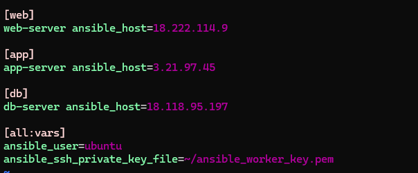

Verify Ansible can reach all hosts:

ansible all -i inventory.ini -m ping

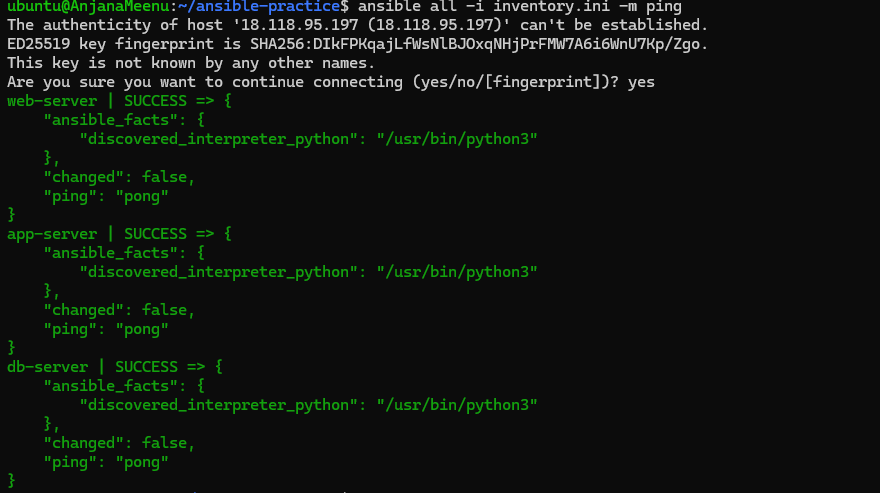

### Task 5: Run Ad-Hoc Commands

1. **Check uptime on all servers:**
ansible all -i inventory.ini -m command -a "uptime"

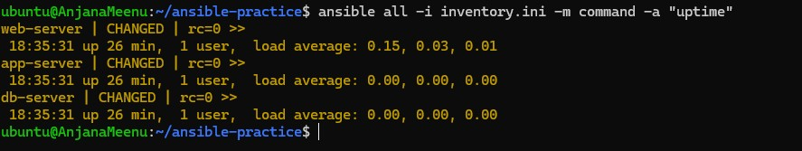

2. **Check free memory on web servers only:**
ansible web -i inventory.ini -m command -a "free -h"

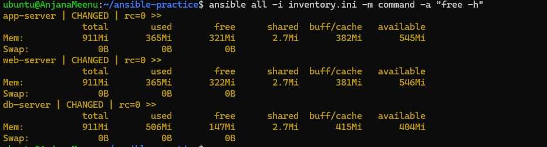

3. **Check disk space on all servers:**

ansible all -i inventory.ini -m command -a "df -h"

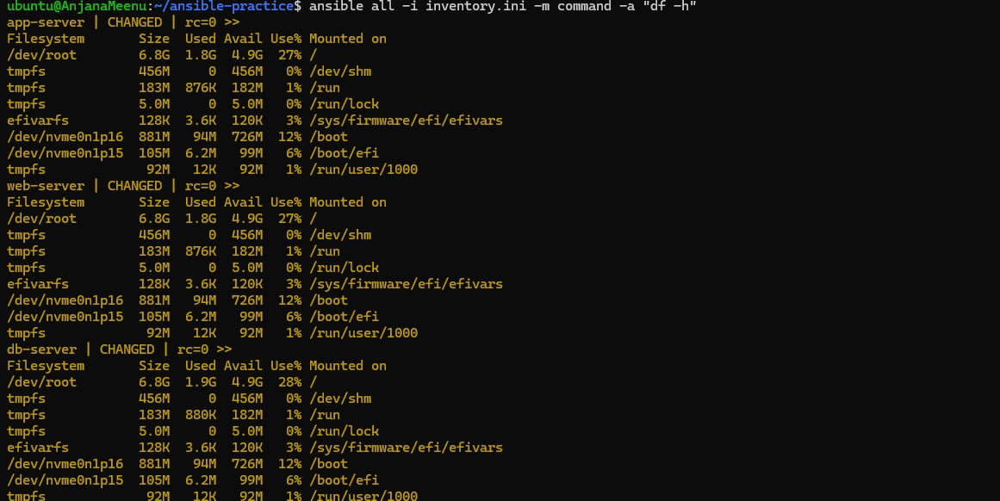

4. **Install a package on the web group:**

ansible web -i inventory.ini -m apt -a "name=git state=present" --become

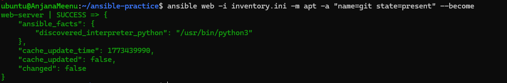

5. **Copy a file to all servers:**

ansible all -i inventory.ini -m copy -a "src=hello.txt dest=/tmp/hello.txt"

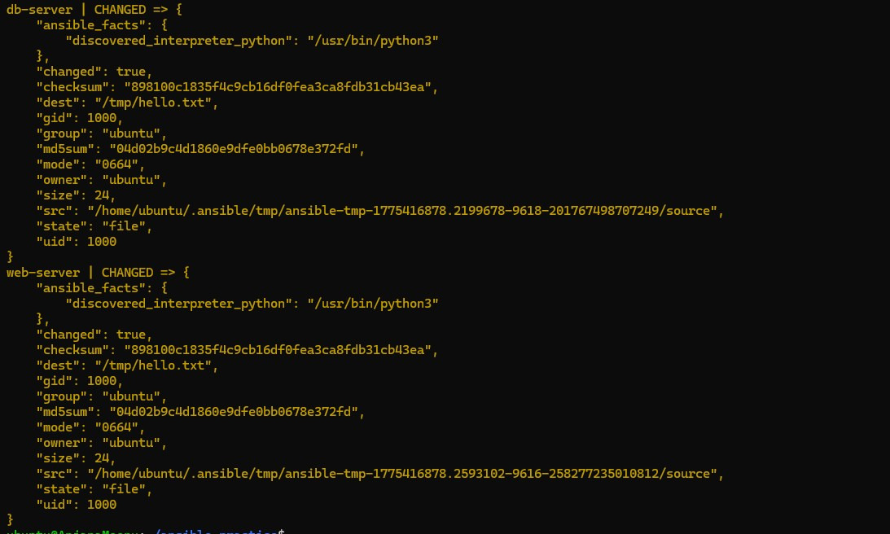

6. **Verify the file was copied:**
 
ansible all -i inventory.ini -m command -a "cat /tmp/hello.txt"

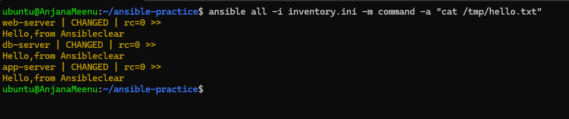

importance of --become

this tells Ansible to elevate sudo previliges which requires before installing packages that require root access

### Task 6: Explore Inventory Groups and Patterns

1. **Create a group of groups** -- add this to your `inventory.ini`:
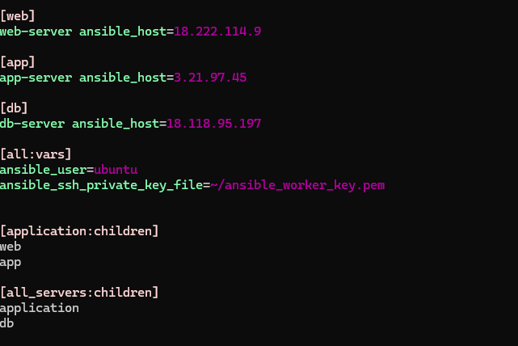

2. Run commands against different groups:

ansible application -i inventory.ini -m ping     # web + app servers
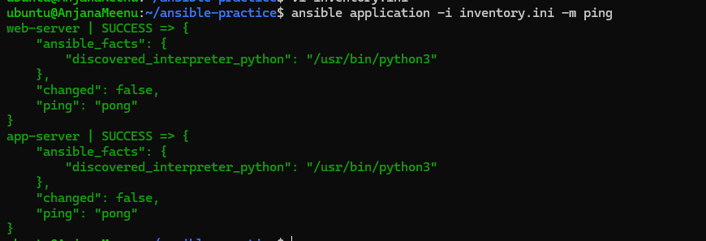

ansible db -i inventory.ini -m ping #ping only db server

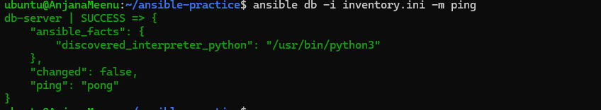

ansible all_servers -i inventory.ini -m ping      # everything

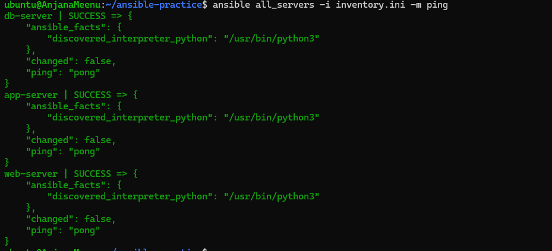

3. **Use patterns:**

ansible 'web:app' -i inventory.ini -m ping        # OR: web or app
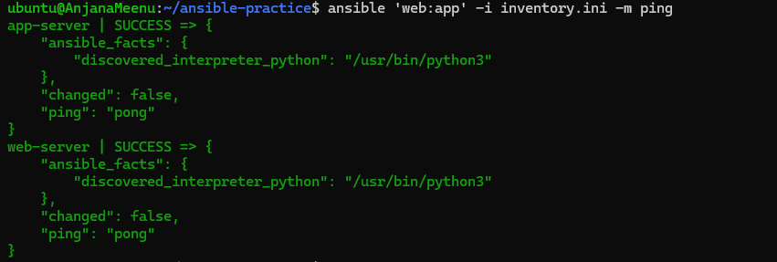

ansible 'all:!db' -i inventory.ini -m ping        # NOT: all except db
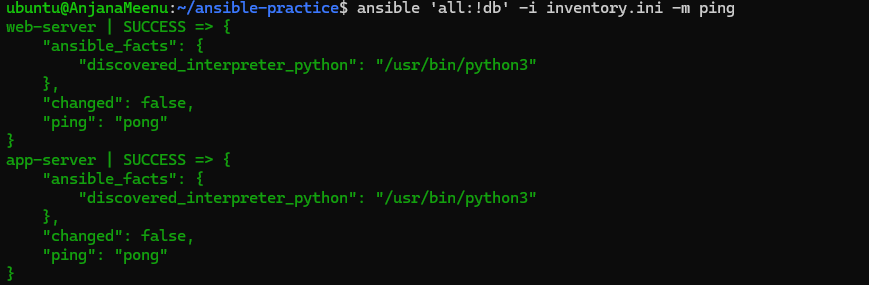

4. **Create an `ansible.cfg`** to avoid typing `-i inventory.ini` every time:

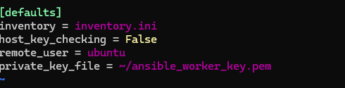

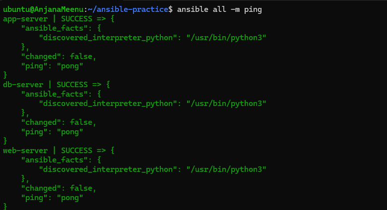

